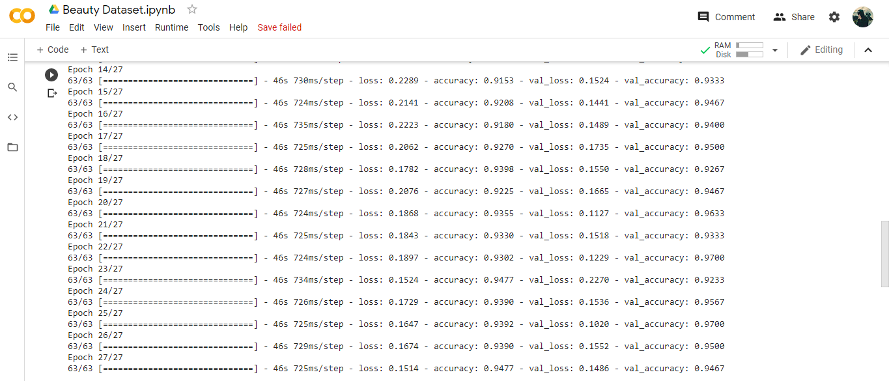
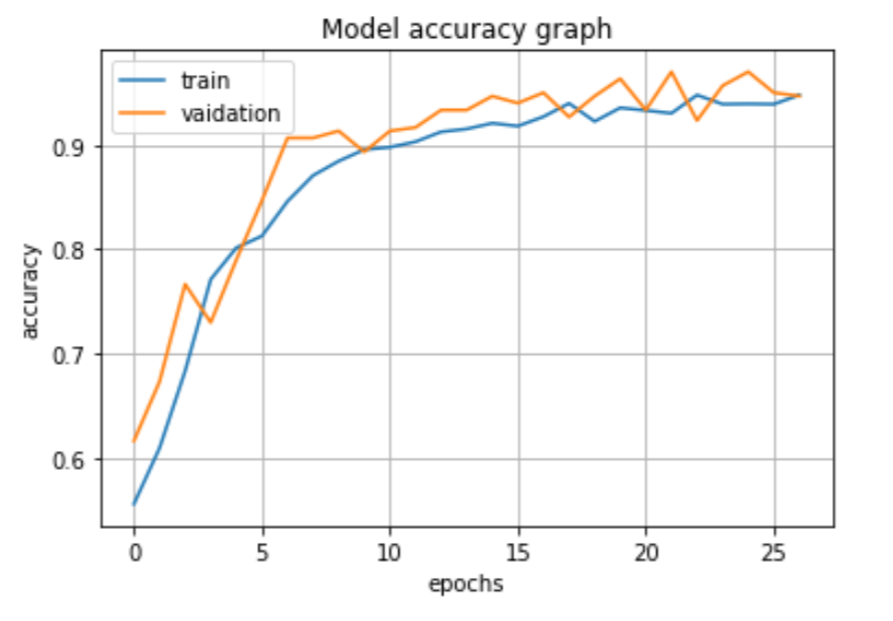

# Beauty-Dataset-Kaggle  
I have trained a model on Beauty Dataset. Data set was created to determine if a CNN could be trained to classify female facial images into one of two classes, Beautiful or Average.The main objective was to check how we seem to have a built in pattern recognition system in our brains that differentiates people by their facial morphology. You can futher read about the dataset on this link https://www.kaggle.com/gpiosenka/beauty-detection-data-set.  
There are 2 classes Beautyiful , Average. There are 4000 images in training dataset while 300 in validation and 300 in testing dataset. All images have same size 224x224 colorful image.  
I trained the model using Image Data Generator in which i used image augmentation of many types such as horizontal flip, zoom, shear, Shift range etc.I used 3 Conv2D layers,3 MaxPooling2D layers,2 Dropout layers and 2 Dense layers.  
It took 27 Epochs to train the model.I got 97% Accuracy on validaton Dataset.  
  
The training curve is also attached below.  
    

